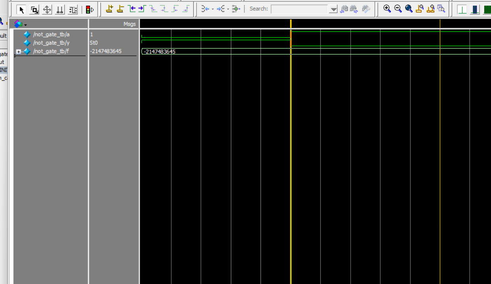

# NOT Gate Simulation – Verilog + ModelSim

這是一個使用 Verilog 設計並模擬 1-input NOT Gate 的小專案，使用 ModelSim 進行模擬，將輸出結果寫入 `monitor_log_not.txt`，並匯出波形圖。

---

## 📂 檔案說明

| 檔案名稱               | 說明                                          |
|------------------------|-----------------------------------------------|
| `not_gate.v`           | NOT Gate 的 Verilog 模組程式                  |
| `not_gate_tb.v`        | 測試平台（Testbench）程式                     |
| `monitor_log_not.txt`  | 模擬輸出結果的紀錄（由 `$fwrite` 寫入）       |
| `not_gate.vcd`         | 模擬產生的 VCD 波形檔，可用於 ModelSim 波形顯示 |
| `wave_not_tb.png`      | 匯出的波形圖（ModelSim 擷取畫面）             |

---

## 🖼 波形圖預覽

> 以下是模擬結果的波形顯示（由 ModelSim 擷取並匯出）



---

## ▶️ 模擬方法（ModelSim）

```tcl
vlib work
vlog not_gate.v not_gate_tb.v
vsim work.not_gate_tb
add wave *
run -all
執行後將產生：

monitor_log_not.txt：模擬文字輸出

not_gate.vcd：可在 ModelSim 中顯示波形

可擷取畫面匯出 wave_not_gate.png

🧪 模擬輸出結果範例

a=0, y=1 @ 0 ns
a=1, y=0 @ 10 ns
📌 備註
使用 $fwrite 進行模擬輸出，更方便記錄到檔案

測試環境為 ModelSim - Intel FPGA Edition 10.5b

適合學習 Verilog 初學者，了解基本邏輯閘與模擬流程
